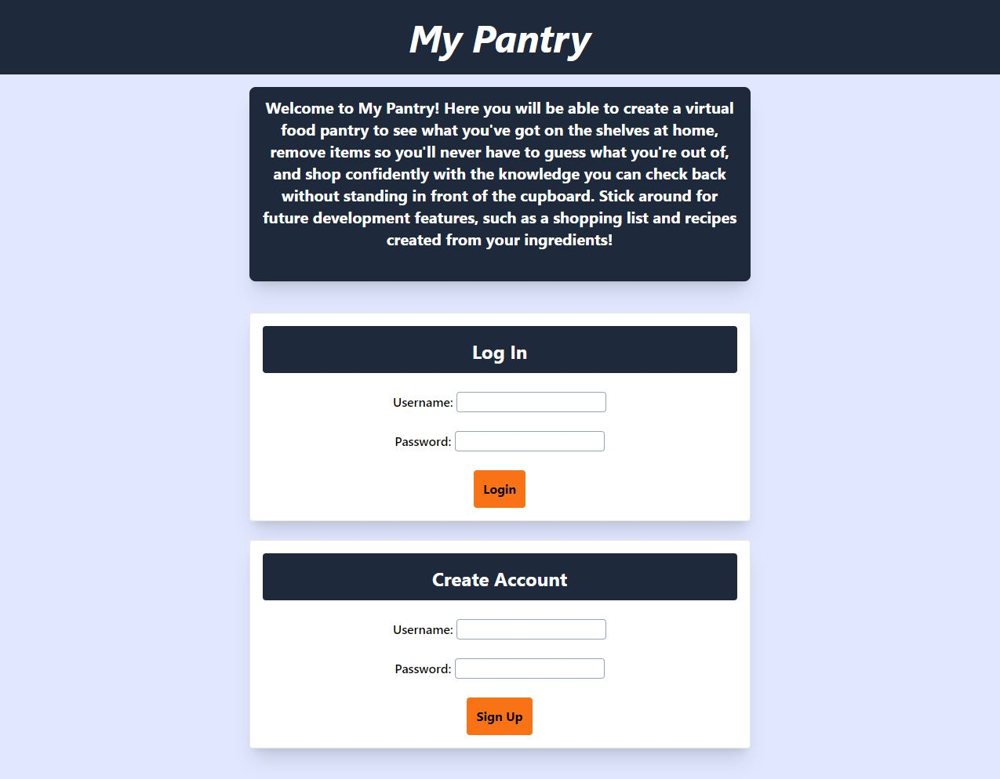
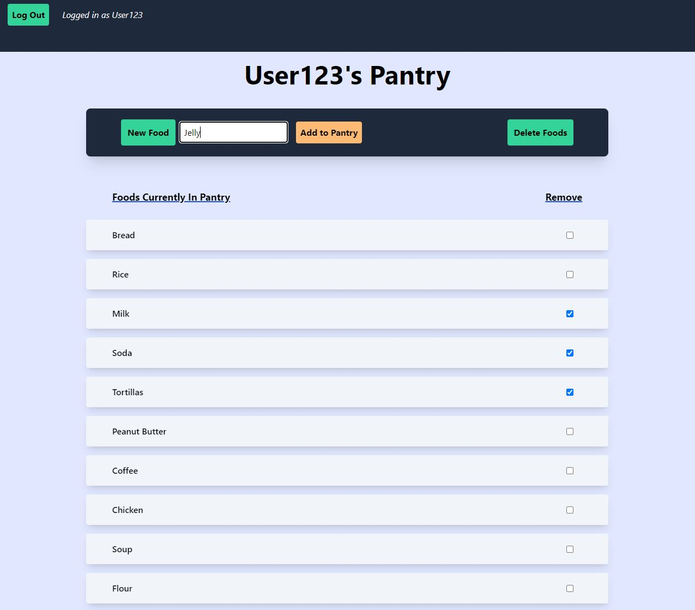

# My Pantry
  ## Description
  My Pantry is a virtual pantry users can bring with them on the go.  With the touch of a button, users can view what foods they have at home and remove the guesswork from grocery shopping, making it easier  to plan out meals and eliminate wasteful duplicates from your shopping cart.  
  Users can log in to view their own pantry, and as your food store at home runs out, it’s easy to update your virtual pantry by removing items and adding items as you buy them.

  ## License
  

  ## Table of Contents
  1. [Installation](#Installation)
  2. [Deployment](#Deployment)
  3. [Usage](#Usage)
  4. [Screenshot](#Screenshot)
  5. [Contributing](#Contributing)
  6. [Technologies](#Technologies)
  7. [Tests](#Tests)
  8. [Questions](#Questions)

  ## Installation
  No installation is required to run this project.  View the 'Deployment' section to find the link to the site.

  ## Deployment
  https://whispering-tundra-55246.herokuapp.com/

  ## Usage
  Users can create an account from the homepage of the site, or log in if they already have created one in the past.  Simply enter a username and password and then click the button.

  From the "My Pantry" screen when a user logs in, they can view any foods that are currently in the pantry in an organized list, as well as click the "New Food" button to bring up a form that will allow the user to type in a new food and add it to the existing pantry.  The food will then be displayed along with all other foods in the pantry.

  Users can also delete foods from the pantry as they run out by first clicking the checkbox on the right of a food item, then clicking the "Delete Foods" button above.

  Clicking "Log Out" at the top left of the pantry screen will log users out and return them to the homepage.

  ## Screenshots

  ### Homepage
  

  ### My Pantry Page
  

  ## Contributing
  Please feel free to contact us if you have questions about contributing to this project.  You can reach out via GitHub  to any of the contributors' linked accounts below.

  ## Technologies
  * Node.js
  * Express.js
  * Sequelize
  * Mysql2
  * MySQL
  * Express-Session
  * Connect-Session-Sequelize
  * Dotenv
  * BCrypt
  * Javascript
  * Tailwind CSS
  * Handlebars
  * Heroku
  * JawsDB

  ## Tests
  No testing frameworks were used in the development of this project, and it does not contain test files.

  ## Questions
  Have questions? Reach out to the project's contributors:

  * [Jonathan (LumberJon1)](https://github.com/LumberJon1)
  * [Drew (MagnificentRoast)](https://github.com/MagnificentRoast)
  * [Kiri (Kirianthony)](https://github.com/Kirianthony)
  * [Griffin (griffin-woodson)](https://github.com/griffin-woodson)
